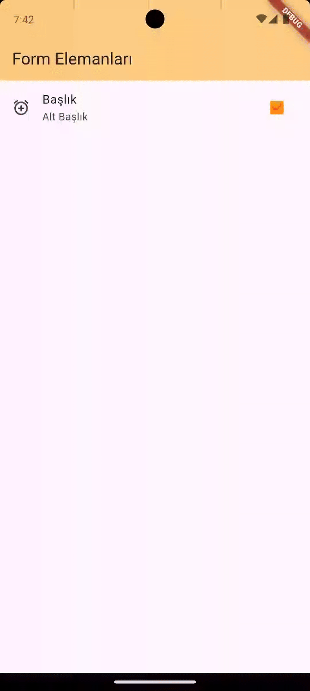

# 🟩 `CheckboxListTile` Widget

## 📘 Tanım

`CheckboxListTile`, Flutter'da bir onay kutusu (Checkbox) ile birlikte başlık, alt başlık ve isteğe bağlı bir simge gösterebilen bir widget’tır.

Kısacası, bir satır içinde checkbox + metin + ikon yerleştirmek için kullanılır.

## 🧩 Örnek

```dart
import 'package:flutter/material.dart';

void main() {
  runApp(const MyApp());
}

class MyApp extends StatefulWidget {
  const MyApp({super.key});

  @override
  State<MyApp> createState() => _MyAppState();
}

class _MyAppState extends State<MyApp> {
  bool _isChecked = true;

  @override
  Widget build(BuildContext context) {
    return MaterialApp(
      home: Scaffold(
        appBar: AppBar(
          title: Text("Form Elemanları"),
          backgroundColor: Colors.orange.shade200,
        ),
        body: Column(
          children: [
            CheckboxListTile(
              title: Text("Başlık"),
              value: _isChecked,
              subtitle: Text("Alt Başlık"),
              checkColor: Colors.red,
              activeColor: Colors.orange,
              secondary: Icon(Icons.add_alarm),
              onChanged: (_secilendeger) {
                setState(() {
                  _isChecked = _secilendeger!;
                });
              },
            ),
          ],
        ),
      ),
    );
  }
}

```



## ⚙️ Parametreler (Önemli Özellikler)

| Parametre           | Tip                       | Açıklama                                                      |
| ------------------- | ------------------------- | ------------------------------------------------------------- |
| **value**           | `bool`                    | Checkbox’ın seçili olup olmadığını belirtir.                  |
| **onChanged**       | `Function(bool?)?`        | Kullanıcı tıkladığında çağrılan fonksiyon. Değeri değiştirir. |
| **title**           | `Widget?`                 | Checkbox’ın yanında gösterilen ana metin.                     |
| **subtitle**        | `Widget?`                 | Alt başlık (isteğe bağlı).                                    |
| **secondary**       | `Widget?`                 | Satırın başına veya sonuna simge ekler.                       |
| **isThreeLine**     | `bool`                    | `true` olursa, alt başlık üçüncü satırda gösterilir.          |
| **controlAffinity** | `ListTileControlAffinity` | Checkbox’ın başta mı sonda mı görüneceğini belirler.          |
| **activeColor**     | `Color?`                  | Checkbox işaretliyken rengi.                                  |
| **checkColor**      | `Color?`                  | Tik (✓) işaretinin rengi.                                     |
| **tileColor**       | `Color?`                  | Tüm satırın arka plan rengi.                                  |
| **selected**        | `bool`                    | `true` olursa yazı stili vurgulanır (örneğin, kalın yazı).    |
| **dense**           | `bool`                    | Daha dar bir görünüm sağlar.                                  |


## 🧠 Kullanım Mantığı

`CheckboxListTile` genellikle bir durum değişkeni (state) ile birlikte kullanılır.

Örneğin bir bool değişken, seçili olup olmadığını takip eder:

`bool _isChecked = false;`


Daha sonra `setState()` içinde değeri güncelleriz.Bu, Flutter’a arayüzü yeniden çizmesi gerektiğini söyler.

## 🧠 Checkbox’ın Konumunu Değiştirme

```dart
CheckboxListTile(
  title: Text("Koyu Tema"),
  value: _darkMode,
  controlAffinity: ListTileControlAffinity.leading, // Checkbox başa alındı
  onChanged: (bool? newValue) {
    setState(() {
      _darkMode = newValue!;
    });
  },
);
```

📋 Açıklama:

`controlAffinity: ListTileControlAffinity.leading` → Checkbox başta görünür.

trailing efekti yerine geçer.

## 💡 Birden Fazla Checkbox Kullanımı
```dart
bool _music = false;
bool _sports = false;
bool _movies = false;
```


```dart
Column(
  children: [
    CheckboxListTile(
      title: Text("Müzik"),
      value: _music,
      onChanged: (value) {
        setState(() => _music = value!);
      },
    ),
    CheckboxListTile(
      title: Text("Spor"),
      value: _sports,
      onChanged: (value) {
        setState(() => _sports = value!);
      },
    ),
    CheckboxListTile(
      title: Text("Filmler"),
      value: _movies,
      onChanged: (value) {
        setState(() => _movies = value!);
      },
    ),
  ],
);
```

📋 Açıklama:

Kullanıcı birden fazla seçeneği aynı anda işaretleyebilir.

Her biri farklı bir bool değişkenle yönetilir.


## 🧩 Örnek

```dart
import 'package:flutter/material.dart';

void main() => runApp(MyApp());

class MyApp extends StatelessWidget {
  @override
  Widget build(BuildContext context) {
    return MaterialApp(
      debugShowCheckedModeBanner: false,
      home: LanguageSelectionPage(),
    );
  }
}

class LanguageSelectionPage extends StatefulWidget {
  @override
  _LanguageSelectionPageState createState() => _LanguageSelectionPageState();
}

class _LanguageSelectionPageState extends State<LanguageSelectionPage> {
  bool _dart = false;
  bool _python = false;
  bool _java = false;
  bool _cpp = false;
  bool _js = false;
  bool _php = false;

  @override
  Widget build(BuildContext context) {
    return Scaffold(
      appBar: AppBar(
        title: Text("💻 Hangi dilleri biliyorsunuz?"),
        backgroundColor: Colors.amber.shade100,
      ),
      body: ListView(
        children: [
          CheckboxListTile(
            title: Text("🦋 Dart"),
            subtitle: Text("Flutter geliştirmede kullanılır."),
            value: _dart,
            activeColor: Colors.indigo,
            onChanged: (bool? value) {
              setState(() {
                _dart = value!;
              });
            },
          ),
          CheckboxListTile(
            title: Text("🐍 Python"),
            subtitle: Text(
              "Veri bilimi, yapay zeka ve otomasyon için popülerdir.",
            ),
            value: _python,
            activeColor: Colors.green,
            onChanged: (bool? value) {
              setState(() {
                _python = value!;
              });
            },
          ),
          CheckboxListTile(
            title: Text("☕ Java"),
            subtitle: Text(
              "Android uygulamaları ve büyük sistemlerde kullanılır.",
            ),
            value: _java,
            activeColor: Colors.orange,
            onChanged: (bool? value) {
              setState(() {
                _java = value!;
              });
            },
          ),
          CheckboxListTile(
            title: Text("💎 C++"),
            subtitle: Text(
              "Oyun motorları ve yüksek performanslı uygulamalarda yaygın.",
            ),
            value: _cpp,
            activeColor: Colors.blueGrey,
            onChanged: (bool? value) {
              setState(() {
                _cpp = value!;
              });
            },
          ),
          CheckboxListTile(
            title: Text("🟨 JavaScript"),
            subtitle: Text("Web siteleri ve frontend geliştirmede kullanılır."),
            value: _js,
            activeColor: Colors.yellow[700],
            onChanged: (bool? value) {
              setState(() {
                _js = value!;
              });
            },
          ),
          CheckboxListTile(
            title: Text("🐘 PHP"),
            subtitle: Text("Web backend geliştirmede kullanılır."),
            value: _php,
            activeColor: Colors.purple,
            onChanged: (bool? value) {
              setState(() {
                _php = value!;
              });
            },
          ),

          Padding(
            padding: const EdgeInsets.all(16.0),
            child: ElevatedButton.icon(
              icon: Icon(Icons.check_circle_outline),
              label: Text("Kaydet"),
              style: ElevatedButton.styleFrom(
                backgroundColor: Colors.amber.shade200,
                padding: EdgeInsets.symmetric(vertical: 14),
                textStyle: TextStyle(fontSize: 18, color: Colors.white),
              ),
              onPressed: () {
                String selected = "";
                if (_dart) selected += "🦋 Dart, ";
                if (_python) selected += "🐍 Python, ";
                if (_java) selected += "☕ Java, ";
                if (_cpp) selected += "💎 C++, ";
                if (_js) selected += "🟨 JavaScript, ";
                if (_php) selected += "🐘 PHP, ";

                if (selected.isEmpty) {
                  selected = "Hiçbir dil seçilmedi 😢";
                } else {
                  // Sondaki virgülü kaldır
                  selected = selected.substring(0, selected.length - 2);
                }

                // SnackBar göster
                ScaffoldMessenger.of(context).showSnackBar(
                  SnackBar(
                    content: Text(selected, style: TextStyle(fontSize: 16)),
                    backgroundColor: Colors.redAccent,

                    duration: Duration(seconds: 3),
                  ),
                );
              },
            ),
          ),
        ],
      ),
    );
  }
}

```
## ⚠️ Dikkat Edilmesi Gerekenler

`onChanged` null ise Checkbox pasif (devre dışı) görünür.

value değişkeni null olamaz — başlangıçta false vermek gerekir.

State yönetimi unutulmamalıdır (örn: setState, Provider, Bloc vb.).
