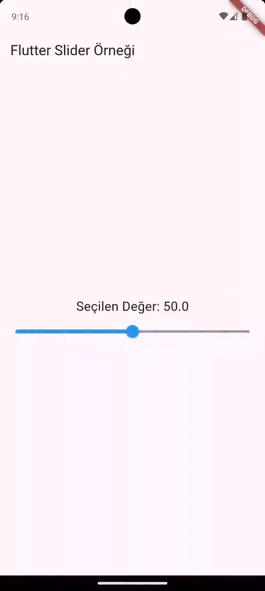
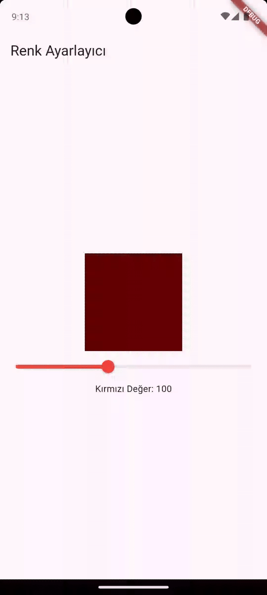

# 🎚️ Slider Widget

`Slider`, Flutter’da tek bir eksen üzerinde (genellikle yatay) kaydırılabilir bir kontrol elemanıdır.

Kullanıcı, parmağını veya fareyi kullanarak bir “thumb” (kaydırma topu) sürükleyerek bir değeri seçer.

## 🧩 Temel Kullanım

```dart
import 'package:flutter/material.dart';

void main() {
  runApp(const MyApp());
}

class MyApp extends StatelessWidget {
  const MyApp({super.key});

  @override
  Widget build(BuildContext context) {
    return MaterialApp(
      home: SliderExample(),
    );
  }
}

class SliderExample extends StatefulWidget {
  @override
  _SliderExampleState createState() => _SliderExampleState();
}

class _SliderExampleState extends State<SliderExample> {
  double _currentValue = 50;

  @override
  Widget build(BuildContext context) {
    return Scaffold(
      appBar: AppBar(title: Text("Flutter Slider Örneği")),
      body: Center(
        child: Column(
          mainAxisAlignment: MainAxisAlignment.center,
          children: [
            Text(
              "Seçilen Değer: ${_currentValue.toStringAsFixed(1)}",
              style: TextStyle(fontSize: 20),
            ),
            Slider(
              value: _currentValue,
              min: 0,
              max: 100,
              divisions: 10, // 10 adımlı bölme (isteğe bağlı)
              label: _currentValue.round().toString(), // üstte gösterilen etiket
              activeColor: Colors.blue, // dolu kısım rengi
              inactiveColor: Colors.grey, // boş kısım rengi
              onChanged: (double value) {
                setState(() {
                  _currentValue = value;
                });
              },
            ),
          ],
        ),
      ),
    );
  }
}
```




### ⚙️ Önemli Parametreler

| Parametre       | Açıklama                                                           |
| --------------- | ------------------------------------------------------------------ |
| `value`         | Slider’ın o anki değeri                                            |
| `min`           | Minimum değer                                                      |
| `max`           | Maksimum değer                                                     |
| `divisions`     | Slider’ı bölmelere ayırır (örneğin 10 = her biri 10’luk aralıklar) |
| `label`         | Değerin üstünde çıkan küçük bilgi etiketi                          |
| `activeColor`   | Seçilen (dolu) kısmın rengi                                        |
| `inactiveColor` | Boş kısmın rengi                                                   |
| `onChanged`     | Kullanıcı değeri değiştirdiğinde çalışır                           |
| `onChangeStart` | Kullanıcı sürüklemeye başladığında çalışır                         |
| `onChangeEnd`   | Kullanıcı sürüklemeyi bitirdiğinde çalışır                         |


## 🧩 Örnek

```dart


import 'package:flutter/material.dart';

void main() {
  runApp(MyApp());
}

class MyApp extends StatelessWidget {
  const MyApp({super.key});

  @override
  Widget build(BuildContext context) {
    return MaterialApp(home: ColorSlider());
  }
}

class ColorSlider extends StatefulWidget {
  @override
  _ColorSliderState createState() => _ColorSliderState();
}

class _ColorSliderState extends State<ColorSlider> {
  double _red = 100;

  @override
  Widget build(BuildContext context) {
    return Scaffold(
      appBar: AppBar(title: Text("Renk Ayarlayıcı")),
      body: Column(
        mainAxisAlignment: MainAxisAlignment.center,
        children: [
          Container(
            height: 150,
            width: 150,
            color: Color.fromRGBO(_red.toInt(), 0, 0, 1),
          ),
          Slider(
            value: _red,
            min: 0,
            max: 255,
            activeColor: Colors.red,
            onChanged: (value) {
              setState(() {
                _red = value;
              });
            },
          ),
          Text("Kırmızı Değer: ${_red.toInt()}"),
        ],
      ),
    );
  }
}

```




## 🔁 RangeSlider (İki Değerli Slider)

Eğer bir aralık seçmek istiyorsan (min ve max gibi):

```dart

import 'package:flutter/material.dart';

void main() {
  runApp(const MyApp());
}

class MyApp extends StatelessWidget {
  const MyApp({super.key});

  @override
  Widget build(BuildContext context) {
    return MaterialApp(home: SliderExample());
  }
}

class SliderExample extends StatefulWidget {
  @override
  _SliderExampleState createState() => _SliderExampleState();
}

class _SliderExampleState extends State<SliderExample> {
  RangeValues _values = RangeValues(10, 50);
  @override
  Widget build(BuildContext context) {
    return Scaffold(
      appBar: AppBar(title: Text("Flutter Slider Örneği")),
      body: Center(
        child: Column(
          mainAxisAlignment: MainAxisAlignment.center,
          children: [
            RangeSlider(
              values: _values,
              min: 0,
              max: 100,
              divisions: 10,
              labels: RangeLabels(
                _values.start.round().toString(),
                _values.end.round().toString(),
              ),
              onChanged: (RangeValues newValues) {
                setState(() {
                  _values = newValues;
                });
              },
            ),
          ],
        ),
      ),
    );
  }
}

```


### 📘 Özet

| Özellik         | Açıklama                             |
| --------------- | ------------------------------------ |
| **Slider**      | Tek değer seçimi                     |
| **RangeSlider** | İki değer (başlangıç – bitiş) seçimi |
| **divisions**   | Adım sayısını belirler               |
| **label**       | Üstte değer gösterir                 |
| **onChanged**   | Değer değişimini yakalar             |


