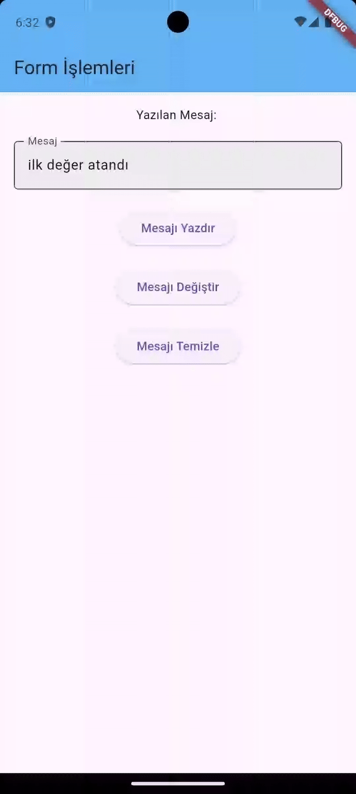

# 🧩 TextField → controller Özelliği (Detaylı Anlatım)

## 📘 Tanım

`controller`, `TextField` içinde yazılan metni kontrol etmeyi sağlayan bir özelliktir.
Bu özellik `TextEditingController` sınıfı ile birlikte kullanılır.

```dart
final myController = TextEditingController();

TextField(
  controller: myController,
);
```

## 🧠 TextEditingController Nedir?

`TextEditingController`, `TextField` veya `TextFormField` gibi metin tabanlı widget’ların içerdiği metni yönetmek için kullanılan bir kontrol nesnesidir.

Bu sınıf sayesinde şunları yapabilirsin:

Kullanıcının yazdığı metni okuyabilirsin:

- Metin alanındaki içeriği programatik olarak değiştirebilirsin

- Dinleyici (listener) ekleyerek her değişikliği algılayabilirsin

- TextField’ı temizleyebilir veya varsayılan değer verebilirsin

### 🧾 En Basit Kullanım
```dart
final myController = TextEditingController();

TextField(
  controller: myController,
);
```

Bu şekilde TextField, myController üzerinden kontrol edilebilir hale gelir.

## 🔍 Controller ile Metni Okuma

Bir butona basıldığında veya bir olay gerçekleştiğinde kullanıcı tarafından girilen metni almak için:
```dart
ElevatedButton(
  onPressed: () {
    print(myController.text);
  },
  child: Text("Göster"),
)
```

🧩 Örnek çıktı:
```dart
Kullanıcının yazdığı metin
```


## ✏️ Controller ile Metni Değiştirme

controller.text’e yeni bir değer atayarak TextField’daki metni değiştirebilirsin:
```dart
myController.text = "Varsayılan metin";
```

Bu atama yapıldığında, TextField içeriği otomatik olarak güncellenir.

## 🧹 Metni Temizleme

Bir TextField’ı temizlemek için:
```dart
myController.clear();
```
## 🪝 Değişiklikleri Dinlemek (addListener)

controller’a bir dinleyici ekleyerek her metin değiştiğinde tepki verebilirsin.
```dart
myController.addListener(() {
  print("Metin değişti: ${myController.text}");
});
```

💡 Bu yöntem onChanged ile benzerdir ama daha kontrolcü düzeyinde çalışır, birden fazla TextField üzerinde aynı anda işlem yapmana olanak tanır.

## ⚠️ dispose() Kullanımı (Çok Önemli)

Eğer TextEditingController bir StatefulWidget içinde kullanılıyorsa, widget ekrandan kalktığında dispose() edilmelidir.
```dart
@override
void dispose() {
  myController.dispose();
  super.dispose();
}
```

Aksi halde bellek sızıntısı (memory leak) oluşabilir.

Bu, özellikle çok sayıda TextField bulunan sayfalarda performans sorunlarına yol açar.

## 🧾 Sık Kullanılan Özellikler


| Özellik / Metot | Açıklama                               | Örnek                              |
| --------------- | -------------------------------------- | ---------------------------------- |
| `text`          | Metnin tamamını alır veya değiştirir   | `myController.text = "Yeni metin"` |
| `selection`     | İmleç (cursor) konumunu kontrol eder   | `myController.selection`           |
| `clear()`       | Metni tamamen siler                    | `myController.clear()`             |
| `addListener()` | Metin her değiştiğinde tetiklenir      | `myController.addListener(() {})`  |
| `dispose()`     | Controller’ı kapatır, belleği temizler | `myController.dispose()`           |


## 🎯 Gerçek Hayatta Kullanım Senaryoları

- Login Formları → Kullanıcı adı ve şifreyi almak

- Arama Kutuları → Yazılan metni anlık olarak filtrelemek

- Form Validasyonu → Boş alan kontrolü yapmak

- Metin Temizleme Butonları → Kullanıcının yazdığı metni sıfırlamak

- Karakter Sayacı → Kullanıcının ne kadar yazdığını göstermek


### 🧩 Örnek

```dart

import 'package:flutter/material.dart';

void main() {
  runApp(MyApp());
}

class MyApp extends StatefulWidget {
  const MyApp({super.key});

  @override
  State<MyApp> createState() => _MyAppState();
}

class _MyAppState extends State<MyApp> {
  var myController = TextEditingController();
  String mesaj = "";

  // Varsayılan metin ekleyelim
  @override
  void initState() {
    super.initState();
    myController.text = "ilk değer atandı";

    myController.addListener(() {
      print("Şu anki metin: ${myController.text}");
    });
  }

  @override
  void dispose() {
    myController.dispose();
    super.dispose();
  }

  @override
  Widget build(BuildContext context) {
    return MaterialApp(
      home: Scaffold(
        appBar: AppBar(
          title: Text("Form İşlemleri"),
          backgroundColor: Colors.blue.shade300,
        ),
        body: Padding(
          padding: const EdgeInsets.all(16.0),
          child: Column(
            children: [
              Text("Yazılan Mesaj: $mesaj"),
              SizedBox(height: 20),
              TextField(
                controller: myController,

                decoration: InputDecoration(
                  labelText: "Mesaj",
                  filled: true,
                  fillColor: Colors.grey.shade200,
                  border: OutlineInputBorder(
                    borderRadius: BorderRadius.circular(5),
                  ),
                ),
              ),

              SizedBox(height: 20),

              ElevatedButton(
                onPressed: () {
                  setState(() {
                    mesaj = myController.text;
                  });
                  print(mesaj);
                },
                child: Text("Mesajı Yazdır"),
              ),

              SizedBox(height: 20),
              ElevatedButton(
                onPressed: () {
                  setState(() {
                    myController.text = "değişen yazı";
                  });
                },
                child: Text("Mesajı Değiştir"),
              ),

              SizedBox(height: 20),
              ElevatedButton(
                onPressed: () {
                  myController.clear();
                },
                child: Text("Mesajı Temizle"),
              ),
            ],
          ),
        ),
      ),
    );
  }
}


```


