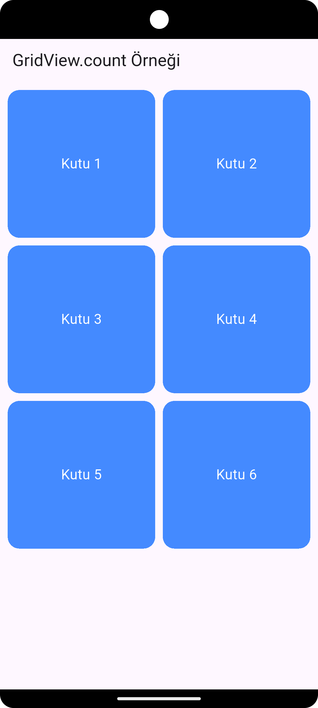

# 📱 Flutter GridView Kullanımı

`GridView`, Flutter’da öğeleri (örneğin resimler, kartlar, butonlar vb.) ızgara (grid) şeklinde göstermek için kullanılır.
Yani ListView’in kare veya dikdörtgen hücrelerden oluşan versiyonu gibidir.

## 🔹 1. GridView Nedir?

`GridView`, çoklu öğeleri satır ve sütunlara bölerek gösterir.
Flutter'da birkaç temel kullanım şekli vardır:

`GridView.count`

`GridView.builder`

`GridView.extent`

`GridView.custom`

## 🔹 2. GridView.count Kullanımı

En basit ve en çok kullanılan yöntemdir.
Sabit sütun sayısı belirterek Grid oluşturur.

📘 Örnek:
```dart
import 'package:flutter/material.dart';

void main() {
  runApp(const MyApp());
}

class MyApp extends StatelessWidget {
  const MyApp({super.key});

  @override
  Widget build(BuildContext context) {
    return MaterialApp(
      debugShowCheckedModeBanner: false,
      home: Scaffold(
        appBar: AppBar(title: const Text('GridView.count Örneği')),
        body: GridView.count(
          crossAxisCount: 2, // her satırda 2 sütun
          crossAxisSpacing: 10, // yatay boşluk
          mainAxisSpacing: 10, // dikey boşluk
          padding: const EdgeInsets.all(10),
          children: List.generate(6, (index) {
            return Container(
              alignment: Alignment.center,
              decoration: BoxDecoration(
                color: Colors.blueAccent,
                borderRadius: BorderRadius.circular(15),
              ),
              child: Text(
                'Kutu ${index + 1}',
                style: const TextStyle(color: Colors.white, fontSize: 18),
              ),
            );
          }),
        ),
      ),
    );
  }
}

```

  

🔍 Açıklama:

`crossAxisCount: 2` → Her satırda 2 kutu gösterir.

`mainAxisSpacing` ve `crossAxisSpacing` → Kutular arası boşluk ayarlar.

`List.generate()` → Otomatik olarak 6 kutu üretir.

## 🔹 3. GridView.builder Kullanımı

Büyük veri listelerinde performans açısından en uygunudur.
Sadece ekranda görünen hücreler oluşturulur (lazy loading).

📘 Örnek:

```dart
import 'package:flutter/material.dart';

class BuilderGridExample extends StatelessWidget {
  final List<String> items = List.generate(50, (index) => 'Öğe ${index + 1}');

  BuilderGridExample({super.key});

  @override
  Widget build(BuildContext context) {
    return Scaffold(
      appBar: AppBar(title: const Text('GridView.builder Örneği')),
      body: GridView.builder(
        gridDelegate: const SliverGridDelegateWithFixedCrossAxisCount(
          crossAxisCount: 3, // her satırda 3 sütun
          crossAxisSpacing: 8,
          mainAxisSpacing: 8,
        ),
        itemCount: items.length,
        itemBuilder: (context, index) {
          return Container(
            color: Colors.teal,
            alignment: Alignment.center,
            child: Text(
              items[index],
              style: const TextStyle(color: Colors.white),
            ),
          );
        },
      ),
    );
  }
}

void main() {
  runApp(MaterialApp(
    home: BuilderGridExample(),
  ));
}
```

