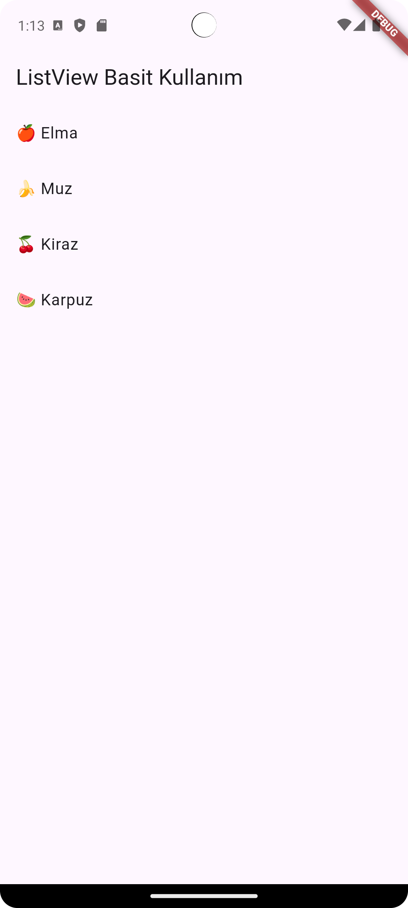
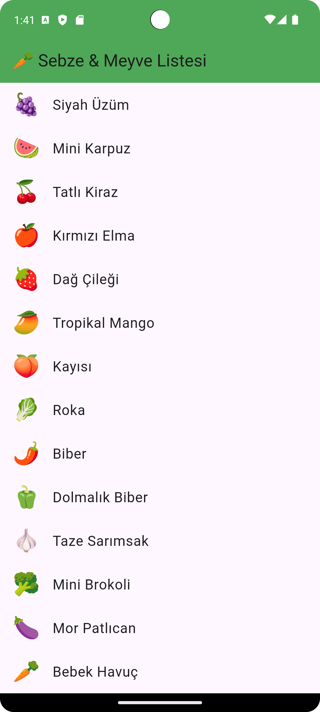
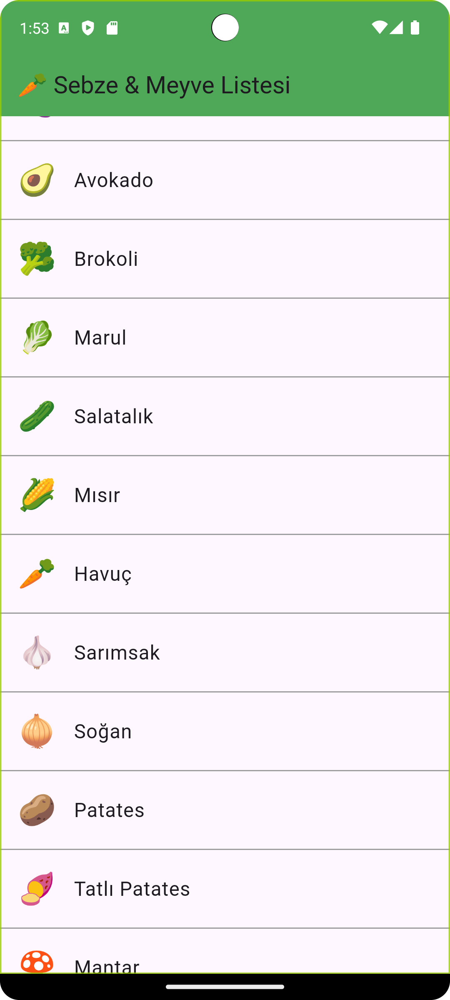

# 📱 Flutter `ListView` Kullanımı

Flutter'da `ListView`, **kaydırılabilir bir liste** oluşturmak için kullanılır.  
Özellikle çok sayıda öğeyi (örneğin mesaj listesi, ürün listesi, ayarlar menüsü vb.) göstermek için en yaygın kullanılan widget'lardan biridir.

---

## 🧱 1. `ListView` Nedir?

`ListView`, dikey veya yatay olarak kaydırılabilen bir **widget listesidir**.

Basitçe söylemek gerekirse:  
Birden fazla öğeyi ekranda alt alta göstermek istiyorsan `Column` yerine `ListView` kullanırsın, çünkü `ListView` kaydırılabilir.

---

## ⚙️ 2. Temel Kullanım

```dart
import 'package:flutter/material.dart';

void main() {
  runApp(const MyApp());
}

class MyApp extends StatelessWidget {
  const MyApp({super.key});

  @override
  Widget build(BuildContext context) {
    return MaterialApp(
      home: Scaffold(
        appBar: AppBar(title: const Text("ListView Basit Kullanım")),
        body: ListView(
          children: const [
            ListTile(title: Text("🍎 Elma")),
            ListTile(title: Text("🍌 Muz")),
            ListTile(title: Text("🍒 Kiraz")),
            ListTile(title: Text("🍉 Karpuz")),
          ],
        ),
      ),
    );
  }
}
```
 

📘 Açıklama:

ListView widget'ı children parametresiyle bir widget listesi alır.
Liste kaydırılabilir (scrollable) olur.


Buradaki elma, muz, kiraz gibi semboller Unicode emoji karakterleridir.
Flutter metinlerde (Text widget’ında) Unicode desteği vardır, bu yüzden direkt görünür.
Kopyala-yapıştır yöntemiyle kullanabilirsin (örn: emojipedia.org)

🔢 Ek Bilgi: Emoji Kodlarını Kullanmak (Unicode)

Eğer emoji karakterini direkt yazmak istemiyorsan, Unicode koduyla da yazabilirsin 👇

```dart

const Text('\u{1F34E} Elma') // 🍎

```
### 🟢 Açıklama:


## 🔁 3. ListView.builder ile Dinamik Liste

Eğer listenin eleman sayısı fazla veya veri bir diziden geliyorsa, ListView.builder kullanmak çok daha verimlidir.


### 🍇 Flutter — Sebze ve Meyve Emojili Liste Örneği

Aşağıdaki örnek, 50 farklı meyve ve sebzeyi emoji ile birlikte gösteren bir `ListView.builder` uygulamasıdır.  
Liste elemanları dinamik olarak `List<String>` içinden oluşturulur.  

---

```dart
import 'package:flutter/material.dart';

void main() {
  runApp(const EmojiListApp());
}

class EmojiListApp extends StatelessWidget {
  const EmojiListApp({super.key});

  @override
  Widget build(BuildContext context) {
    final List<String> sebzeMeyveler = [
      "🍎 Elma",
      "🍏 Yeşil Elma",
      "🍐 Armut",
      "🍊 Portakal",
      "🍋 Limon",
      "🍌 Muz",
      "🍉 Karpuz",
      "🍇 Üzüm",
      "🍓 Çilek",
      "🍈 Kavun",
      "🍒 Kiraz",
      "🍑 Şeftali",
      "🥭 Mango",
      "🍍 Ananas",
      "🥥 Hindistan Cevizi",
      "🥝 Kivi",
      "🍅 Domates",
      "🍆 Patlıcan",
      "🥑 Avokado",
      "🥦 Brokoli",
      "🥬 Marul",
      "🥒 Salatalık",
      "🌽 Mısır",
      "🥕 Havuç",
      "🧄 Sarımsak",
      "🧅 Soğan",
      "🥔 Patates",
      "🍠 Tatlı Patates",
      "🍄 Mantar",
      "🥜 Fıstık",
      "🌰 Kestane",
      "🍞 Ekmek",
      "🫐 Yaban Mersini",
      "🍋 Limon Dilimi",
      "🍍 Ananas Dilimi",
      "🍈 Kavun Dilimi",
      "🥥 Cevizli Tatlı",
      "🍇 Siyah Üzüm",
      "🍉 Mini Karpuz",
      "🍒 Tatlı Kiraz",
      "🍎 Kırmızı Elma",
      "🍓 Dağ Çileği",
      "🥭 Tropikal Mango",
      "🍑 Kayısı",
      "🥬 Roka",
      "🌶️ Biber",
      "🫑 Dolmalık Biber",
      "🧄 Taze Sarımsak",
      "🥦 Mini Brokoli",
      "🍆 Mor Patlıcan",
      "🥕 Bebek Havuç",
    ];

    return MaterialApp(
      debugShowCheckedModeBanner: false,
      home: Scaffold(
        appBar: AppBar(
          title: const Text("🥕 Sebze & Meyve Listesi"),
          backgroundColor: Colors.green,
        ),
        body: ListView.builder(
          itemCount: sebzeMeyveler.length,
          itemBuilder: (context, index) {
            final item = sebzeMeyveler[index];
            final parts = item.split(" ");
            final emoji = parts[0];
            final name = parts.sublist(1).join(" ");
            return ListTile(
              leading: Text(
                emoji,
                style: const TextStyle(fontSize: 28),
              ),
              title: Text(
                name,
                style: const TextStyle(fontSize: 18),
              ),
            );
          },
        ),
      ),
    );
  }
}
```
 

### 🟢 Avantajı:
Sadece ekranda görünen elemanlar oluşturulur.
Böylece performans artar, özellikle uzun listelerde çok önemlidir.

## 🎯 4. ListView.separated ile Aralara Ayırıcı (Divider) Ekleme

Liste elemanlarının arasına kolayca çizgi, boşluk veya özel widget eklemek için kullanılır.

```dart
ListView.separated(
  itemCount: 5,
  itemBuilder: (context, index) {
    return ListTile(
      title: Text("Öğe $index"),
      leading: const Icon(Icons.star),
    );
  },
  separatorBuilder: (context, index) {
    return const Divider(
      color: Colors.grey,
      thickness: 1,
    );
  },
)
```
 


📘 Kullanım Amacı:
Liste öğeleri arasında çizgi veya boşluk eklemek.

## 🧭 5. Yatay (Horizontal) Liste

Yatay kaydırma yapmak için scrollDirection parametresi kullanılır.
```dart
ListView(
  scrollDirection: Axis.horizontal,
  children: [
    Container(width: 120, color: Colors.red),
    Container(width: 120, color: Colors.green),
    Container(width: 120, color: Colors.blue),
    Container(width: 120, color: Colors.orange),
  ],
)
```
📘 Not:
Yatay liste genelde ürün kaydırma, kategori gösterimi gibi alanlarda kullanılır.

## 🧩 6. ListView İçinde Farklı Widget’lar

ListView sadece Text veya ListTile değil, her türlü widget’ı içerebilir.
```dart
ListView(
  padding: const EdgeInsets.all(8),
  children: [
    const Text("Başlık", style: TextStyle(fontSize: 24)),
    Image.network("https://picsum.photos/200/300"),
    const SizedBox(height: 10),
    ElevatedButton(
      onPressed: () {},
      child: const Text("Tıkla"),
    ),
  ],
)
```
## 🧮 7. ListView + Card Kullanımı

Card widget’ı ile daha güzel görünümler elde edebilirsin.
```dart
ListView.builder(
  itemCount: 5,
  itemBuilder: (context, index) {
    return Card(
      color: Colors.blue[50],
      margin: const EdgeInsets.all(8),
      child: ListTile(
        leading: const Icon(Icons.person),
        title: Text("Kullanıcı $index"),
        subtitle: const Text("Detay bilgisi"),
        trailing: const Icon(Icons.arrow_forward_ios),
      ),
    );
  },
)
```
## 🧱 8. ListView İçinde Scroll Sorunu (Nested List)

Bir ListView başka bir ListView içinde kullanılacaksa şu özellik zorunludur:
```dart
ListView(
  shrinkWrap: true,
  physics: const NeverScrollableScrollPhysics(),
  children: [
    // Alt listeler buraya
  ],
)
```


🧠 Açıklama:

shrinkWrap: true → Liste, içeriği kadar yer kaplar.

NeverScrollableScrollPhysics() → Kaydırma devre dışı olur (üstteki liste kaydırmayı kontrol eder).

## 🧩 9. Ekstra: ListView.custom

Kendi özel yapılandırmanı tanımlamak istersen ListView.custom kullanabilirsin.
Ancak çoğu durumda builder veya separated yeterlidir.


📘 Özet

| Kullanım             | Açıklama                               |
| -------------------- | -------------------------------------- |
| `ListView`           | Basit liste, tüm elemanlar oluşturulur |
| `ListView.builder`   | Dinamik ve performanslı liste          |
| `ListView.separated` | Araya ayırıcı (Divider) ekler          |
| `ListView.custom`    | Özel yapılar için                      |
| `scrollDirection`    | Dikey/Yatay liste ayarı                |


