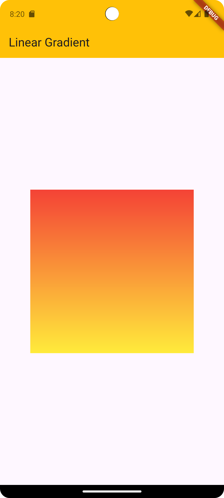

# 🎨 Flutter BoxDecoration — Tüm Detaylarıyla Rehber

BoxDecoration, Flutter’da Container, Box, Card gibi widget’ların arka planını (background), kenarlıklarını (border), köşe yuvarlamalarını (borderRadius), gölgelerini (boxShadow), ve hatta arka plan resimlerini (image) ayarlamak için kullanılan güçlü bir sınıftır.

---
## 🎨 1. Renk Ekleme `(color)`

```dart
Center(
        child: Container(
          decoration: BoxDecoration(
            color: Colors.blue, // Arka plan rengi
          ),
          child: Text(
            "Merhaba Flutter!",
            style: TextStyle(color: Colors.white),
          ),
        ),
      )
```


Açıklama:

`decoration` parametresi sadece Container içinde kullanılabilir.

`color, border, borderRadius, gradient, image, boxShadow, shape` gibi özellikleri vardır.

## 🟪 2. Köşeleri Yuvarlama (borderRadius)

```dart
Container(
  height: 100,
  width: 200,
  decoration: BoxDecoration(
    color: Colors.teal,
    borderRadius: BorderRadius.circular(20),
  ),
)

```


### 🔹 Diğer Kullanım Biçimleri

```dart
borderRadius: BorderRadius.only(
  topLeft: Radius.circular(30),
  bottomRight: Radius.circular(10),
)
```

`BorderRadius.circular()` — Tüm köşeleri eşit yuvarlar

`BorderRadius.only()` — Belirli köşeleri yuvarlar

## 🖼️ 3. Arka Plan Görseli (image)

```dart
Container(
  height: 200,
  width: 300,
  decoration: BoxDecoration(
    image: DecorationImage(
      image: AssetImage('assets/images/background.jpg'),
      fit: BoxFit.cover,
    ),
  ),
)
```

### 🔸 Network Image örneği

```dart
image: DecorationImage(
  image: NetworkImage('https://picsum.photos/300/200'),
  fit: BoxFit.cover,
)
```


## 🌈 4. Renk Geçişi (Gradient)

### 🔹 Linear Gradient (Doğrusal)
```dart
 Container(
          height: 300,
          width: 300,
          decoration: BoxDecoration(
            gradient: LinearGradient(
              colors: [Colors.red, Colors.yellow],
              begin: Alignment.topCenter,
              end: Alignment.bottomCenter,
            ),
          ),
        ),
```



### 🔹 Radial Gradient (Dairesel)
```dart
decoration: BoxDecoration(
  gradient: RadialGradient(
    colors: [Colors.blue, Colors.black],
    radius: 0.8,
  ),
)
```
### 🔹 Sweep Gradient (Dönel)
```dart
decoration: BoxDecoration(
  gradient: SweepGradient(
    colors: [Colors.yellow, Colors.red, Colors.blue],
  ),
)
```
🔸 Gradient’ler arka plan rengine göre daha yüksek önceliğe sahiptir.

## ⚙️ 5. Kenarlık Ekleme (border)
### 🔹 Tüm kenarlara eşit kenarlık

```dart
Container(
  decoration: BoxDecoration(
    color: Colors.white,
    border: Border.all(
      color: Colors.black,
      width: 2,
    ),
  ),
)
```

### 🔹 Sadece belirli kenarlara
```dart
decoration: BoxDecoration(
  border: Border(
    top: BorderSide(color: Colors.red, width: 2),
    bottom: BorderSide(color: Colors.blue, width: 3),
  ),
)
```

## 🕶️ 6. Gölge Ekleme (boxShadow)
```dart
Container(
  decoration: BoxDecoration(
    color: Colors.white,
    boxShadow: [
      BoxShadow(
        color: Colors.grey.withOpacity(0.5),
        blurRadius: 10,
        spreadRadius: 3,
        offset: Offset(5, 5), // x, y yönü
      ),
    ],
  ),
)
```

shape özelliği iki değer alır:

BoxShape.rectangle (varsayılan)

BoxShape.circle

## 🔍 7. color ve decoration Çakışması
```dart
Container(
  color: Colors.red,
  decoration: BoxDecoration(
    color: Colors.blue,
  ),
)
```

✅ Yalnızca decoration içinde renk belirtmelisin.

