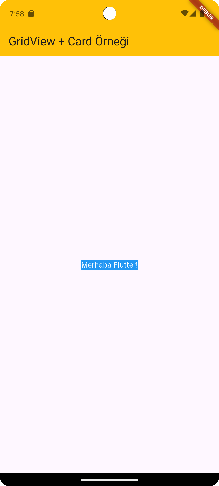
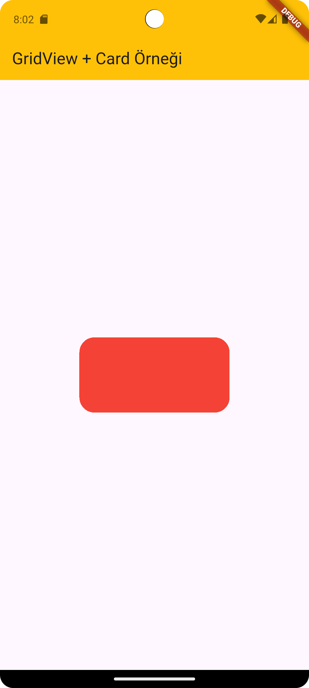

# 🎨 Flutter BoxDecoration — Tüm Detaylarıyla Rehber

BoxDecoration, Flutter’da Container, Box, Card gibi widget’ların arka planını (background), kenarlıklarını (border), köşe yuvarlamalarını (borderRadius), gölgelerini (boxShadow), ve hatta arka plan resimlerini (image) ayarlamak için kullanılan güçlü bir sınıftır.

---
## 🎨 1. Renk Ekleme `(color)`

```dart
Center(
        child: Container(
          decoration: BoxDecoration(
            color: Colors.blue, // Arka plan rengi
          ),
          child: Text(
            "Merhaba Flutter!",
            style: TextStyle(color: Colors.white),
          ),
        ),
      )
```


Açıklama:

`decoration` parametresi sadece Container içinde kullanılabilir.

`color, border, borderRadius, gradient, image, boxShadow, shape` gibi özellikleri vardır.

## 🟪 2. Köşeleri Yuvarlama (borderRadius)

```dart
Container(
  height: 100,
  width: 200,
  decoration: BoxDecoration(
    color: Colors.teal,
    borderRadius: BorderRadius.circular(20),
  ),
)

```



### 🔹 Diğer Kullanım Biçimleri

```dart
borderRadius: BorderRadius.only(
  topLeft: Radius.circular(30),
  bottomRight: Radius.circular(10),
)
```

`BorderRadius.circular()` — Tüm köşeleri eşit yuvarlar

`BorderRadius.only()` — Belirli köşeleri yuvarlar

## 🖼️ 3. Arka Plan Görseli (image)

```dart
Container(
  height: 200,
  width: 300,
  decoration: BoxDecoration(
    image: DecorationImage(
      image: AssetImage('assets/images/background.jpg'),
      fit: BoxFit.cover,
    ),
  ),
)
```


