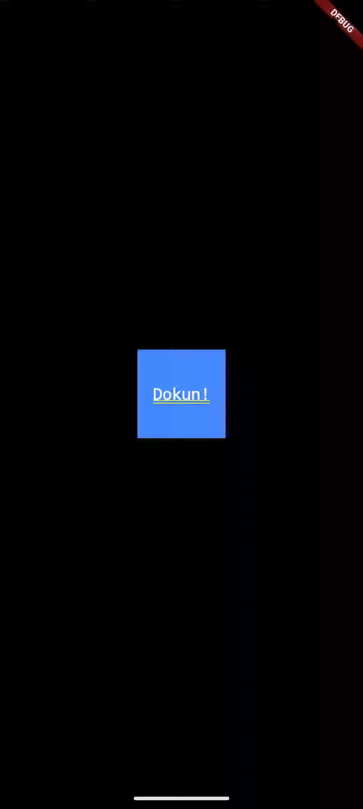

# 🖐️ Flutter GestureDetector Kullanımı (Detaylı Anlatım)

Flutter’da GestureDetector, kullanıcı etkileşimlerini (dokunma, sürükleme, çift tıklama, uzun basma vb.) algılamak için kullanılan güçlü bir widget’tır.

Herhangi bir görsel bileşeni “dokunulabilir” veya “hareketle kontrol edilebilir” hale getirmek için kullanılır.

## 🔍 Temel Tanım

```dart
GestureDetector(
  onTap: () {
    print('Ekrana dokunuldu!');
  },
  child: Container(
    color: Colors.blue,
    padding: EdgeInsets.all(20),
    child: Text('Dokun Bana!', style: TextStyle(color: Colors.white)),
  ),
);
```

📌 Bu örnekte Container, bir dokunma (tap) olayına duyarlı hale getirilmiştir.

## 🧩 Desteklenen Olaylar

GestureDetector, çok sayıda dokunma ve hareket türünü algılayabilir:

| Olay                                          | Açıklama                                                    |
| --------------------------------------------- | ----------------------------------------------------------- |
| `onTap`                                       | Tek tıklama algılar.                                        |
| `onDoubleTap`                                 | Çift tıklamayı algılar.                                     |
| `onLongPress`                                 | Uzun süre basılı tutmayı algılar.                           |
| `onTapDown`                                   | Parmağın ekrana değdiği an.                                 |
| `onTapUp`                                     | Parmağın kaldırıldığı an.                                   |
| `onTapCancel`                                 | Dokunma iptal edildiğinde tetiklenir.                       |
| `onVerticalDragStart`                         | Dikey sürükleme başladığında.                               |
| `onVerticalDragUpdate`                        | Dikey sürükleme hareketi boyunca.                           |
| `onVerticalDragEnd`                           | Dikey sürükleme bittiğinde.                                 |
| `onHorizontalDragStart`                       | Yatay sürükleme başladığında.                               |
| `onHorizontalDragUpdate`                      | Yatay sürükleme hareketi boyunca.                           |
| `onHorizontalDragEnd`                         | Yatay sürükleme bittiğinde.                                 |
| `onPanStart`, `onPanUpdate`, `onPanEnd`       | Serbest (hem yatay hem dikey) sürükleme hareketleri.        |
| `onScaleStart`, `onScaleUpdate`, `onScaleEnd` | İki parmakla büyütme/küçültme (zoom) hareketlerini algılar. |


### 🧠 Örnek: Çift Tıklama ve Uzun Basma

```dart
GestureDetector(
  onDoubleTap: () {
    print('Çift tıklandı!');
  },
  onLongPress: () {
    print('Uzun basıldı!');
  },
  child: Container(
    color: Colors.orange,
    width: 150,
    height: 150,
    alignment: Alignment.center,
    child: Text('Deneme Kutusu'),
  ),
);
```

## 🎯 Sürükleme (Drag) Örneği
```dart
double _x = 0;
double _y = 0;

GestureDetector(
  onPanUpdate: (details) {
    _x += details.delta.dx;
    _y += details.delta.dy;
  },
  child: Transform.translate(
    offset: Offset(_x, _y),
    child: Container(
      width: 100,
      height: 100,
      color: Colors.green,
    ),
  ),
);
```

📌 Bu örnekte, kutu parmak hareketiyle ekranda sürüklenebilir hale getirilmiştir.

## ⚙️ onTapDown / onTapUp ile Geri Bildirim Ekleme
```dart
GestureDetector(
  onTapDown: (_) => print('Basıldı'),
  onTapUp: (_) => print('Kaldırıldı'),
  child: Container(
    color: Colors.purple,
    padding: EdgeInsets.all(20),
    child: Text('Bas ve bırak', style: TextStyle(color: Colors.white)),
  ),
);
```

## 🎨 Görsel Geri Bildirim İstiyorsan: InkWell veya InkResponse

GestureDetector, dokunma efekti (ripple effect) göstermez.
Kullanıcıya görsel geri bildirim vermek istiyorsan şu alternatifleri kullanabilirsin:

### 🔸 1. InkWell (en çok kullanılan alternatif)
```dart
InkWell(
  onTap: () {
    print('InkWell tıklandı!');
  },
  child: Container(
    padding: EdgeInsets.all(16),
    color: Colors.blue,
    child: Text('Dokun', style: TextStyle(color: Colors.white)),
  ),
);
```

📍 Avantajı: Ripple efekti (dalga animasyonu) gösterir.
📍 Dezavantajı: Material widget içinde kullanılmalıdır (aksi halde efekt görünmez).

### 🔸 2. InkResponse (daha gelişmiş versiyon)
```dart
InkResponse(
  onTap: () {
    print('InkResponse tıklandı!');
  },
  radius: 40,
  child: Icon(Icons.favorite, size: 50, color: Colors.red),
);
```

📍 InkResponse, InkWell’a benzer fakat efektin merkezi ve yarıçapı üzerinde daha fazla kontrol sağlar.

### ⚖️ Karşılaştırma Tablosu

| Özellik                   | GestureDetector | InkWell   | InkResponse |
| ------------------------- | --------------- | --------- | ----------- |
| Ripple efekti             | ❌ Yok           | ✅ Var     | ✅ Var       |
| Görsel geri bildirim      | ❌ Yok           | ✅ Var     | ✅ Var       |
| Material bağımlılığı      | ❌ Yok           | ✅ Gerekli | ✅ Gerekli   |
| Gelişmiş hareket algılama | ✅ Evet          | ⚪ Sınırlı | ⚪ Sınırlı   |
| Performans                | ✅ Hafif         | ✅ Hafif   | ✅ Hafif     |


### 🧱 En İyi Kullanım Senaryoları

GestureDetector → özel animasyonlar, sürükleme, pinch zoom, pan hareketleri gibi gelişmiş durumlar.

InkWell / InkResponse → buton benzeri öğeler (örn. menü, liste öğesi) için.

### 🧩 Örnek: GestureDetector + Animasyon

```dart
class AnimatedBox extends StatefulWidget {
  @override
  _AnimatedBoxState createState() => _AnimatedBoxState();
}

class _AnimatedBoxState extends State<AnimatedBox> {
  double _size = 100;

  @override
  Widget build(BuildContext context) {
    return Center(
      child: GestureDetector(
        onTap: () {
          setState(() {
            _size = _size == 100 ? 200 : 100;
          });
        },
        child: AnimatedContainer(
          duration: Duration(milliseconds: 300),
          color: Colors.blueAccent,
          width: _size,
          height: _size,
          alignment: Alignment.center,
          child: Text(
            'Dokun!',
            style: TextStyle(color: Colors.white, fontSize: 18),
          ),
        ),
      ),
    );
  }
}
```

📌 Dokunulduğunda kutu büyüyüp küçülür.




### 🧩 Örnek: GestureDetector Örnek Uygulaması

Aşağıda Flutter’da farklı jestleri (tap, double tap, long press, drag) tek ekranda gösteren interaktif bir örnek uygulama kodu var.
Kod doğrudan çalıştırılabilir ve her hareket türü için ayrı bir tepki verir.

```dart
import 'package:flutter/material.dart';

void main() => runApp(GestureDemoApp());

class GestureDemoApp extends StatelessWidget {
  @override
  Widget build(BuildContext context) {
    return MaterialApp(
      title: 'GestureDetector Demo',
      debugShowCheckedModeBanner: false,
      home: GestureDemoPage(),
    );
  }
}

class GestureDemoPage extends StatefulWidget {
  @override
  _GestureDemoPageState createState() => _GestureDemoPageState();
}

class _GestureDemoPageState extends State<GestureDemoPage> {
  String _message = "🖐️ Bir hareket yap!";
  double _x = 0;
  double _y = 0;

  @override
  Widget build(BuildContext context) {
    return Scaffold(
      appBar: AppBar(
        title: const Text("GestureDetector Örneği"),
        backgroundColor: Colors.blueAccent,
      ),
      body: Stack(
        children: [
          Center(
            child: Text(
              _message,
              style: const TextStyle(fontSize: 22, fontWeight: FontWeight.bold),
              textAlign: TextAlign.center,
            ),
          ),

          // 🟦 Sürüklenebilir kutu
          Positioned(
            left: MediaQuery.of(context).size.width / 2 - 50 + _x,
            top: MediaQuery.of(context).size.height / 2 - 50 + _y,
            child: GestureDetector(
              onTap: () {
                setState(() {
                  _message = "👆 Tek dokundun!";
                });
              },
              onDoubleTap: () {
                setState(() {
                  _message = "✌️ Çift tıklama algılandı!";
                });
              },
              onLongPress: () {
                setState(() {
                  _message = "⏱️ Uzun bastın!";
                });
              },
              onPanUpdate: (details) {
                setState(() {
                  _x += details.delta.dx;
                  _y += details.delta.dy;
                  _message = "🚚 Sürükleniyor...";
                });
              },
              onPanEnd: (_) {
                setState(() {
                  _message = "🛑 Sürükleme bitti!";
                });
              },
              child: AnimatedContainer(
                duration: const Duration(milliseconds: 200),
                width: 100,
                height: 100,
                decoration: BoxDecoration(
                  color: Colors.blueAccent,
                  borderRadius: BorderRadius.circular(16),
                  boxShadow: [
                    BoxShadow(
                      color: Colors.black26,
                      blurRadius: 10,
                      offset: Offset(3, 3),
                    ),
                  ],
                ),
                alignment: Alignment.center,
                child: const Text(
                  "Kutu",
                  style: TextStyle(color: Colors.white, fontSize: 18),
                ),
              ),
            ),
          ),
        ],
      ),
    );
  }
}
```

🔍 Kod Açıklaması

| Bölüm               | Açıklama                                             |
| ------------------- | ---------------------------------------------------- |
| `onTap`             | Tek dokunma algılar.                                 |
| `onDoubleTap`       | Çift tıklama algılar.                                |
| `onLongPress`       | Uzun basma algılar.                                  |
| `onPanUpdate`       | Parmağın ekranda sürüklenme hareketini algılar.      |
| `onPanEnd`          | Sürükleme işlemi bittiğinde tetiklenir.              |
| `_x`, `_y`          | Kutunun yeni konumunu tutar.                         |
| `AnimatedContainer` | Kutunun animasyonlu şekilde hareket etmesini sağlar. |


## 🔚 Sonuç

`GestureDetector:` Etkileşim algılamak için esnek ve güçlüdür.

`InkWell` ve `InkResponse:` Görsel geri bildirim gerektiren durumlarda idealdir.

Genellikle UI etkileşimleri için `InkWell`, animasyon ve özel hareketler için `GestureDetector` tercih edilir.

